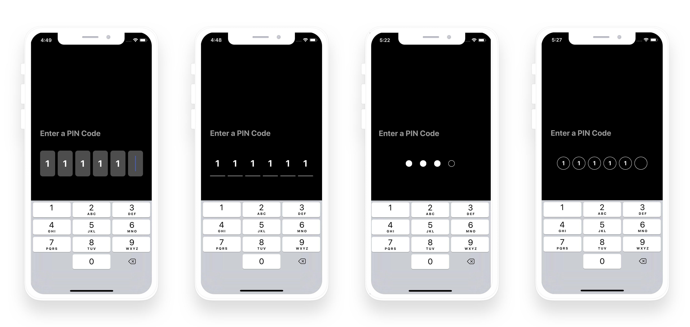

# PinCodeInputView
A text input view for entering pin code. 



## Features

- something...

## Getting Started


### View Hierarchy

SurfaceView is used to detect a user gesture.
ItemView is Appearance. You can customize ItemView.


```swift
private class ContainerItemView<T: UIView & ItemType>: UIView {
    var item: T
    private let surface: UIView = .init()
    private var didTapHandler: (() -> ())?
}
```

To create your customize ItemView, you create a view conforming to ItemType.
```swift
public protocol ItemType {
    var text: Character? { get set }
    var isHiddenCursor: Bool { get set }
    func set(appearance: Appearance)
}
```

About  to set appearance.
```swift
public struct Appearance { }

pinCodeInputView.set(appearance: )
```


## Usage


```swift
import PinCodeInputView
```

### standard
```swift

// initialize
let pinCodeInputView: PinCodeInputView<ItemView> = .init(
    digit: 6,
    itemFactory: {
    return ItemView()
})

view.addSubview(pinCodeInputView)

// set appearanceå
pinCodeInputView.set(
    appearance: .init(
        itemSize: .init(width: 44, height: 68),
        font: .systemFont(ofSize: 28, weight: .bold),
        textColor: .white,
        backgroundColor: .darkGray,
        cursorColor: .blue,
        cornerRadius: 8,
        spacing: 8
    )
)

// text handling
pinCodeInputView.set(changeTextHandler: { text in
    print(text)
})
```

### customize

```swift
final class CustomItemView: UIView, ItemType {
    var text: Character?
    var isHiddenCursor: Bool
    func set(appearance: Appearance) {}
    
    // ...
}

let pinCodeInputView: PinCodeInputView<CustomItemView> = .init(
    digit: 6,
    itemFactory: {
    return CustomItemView()
})
```

## Installation


